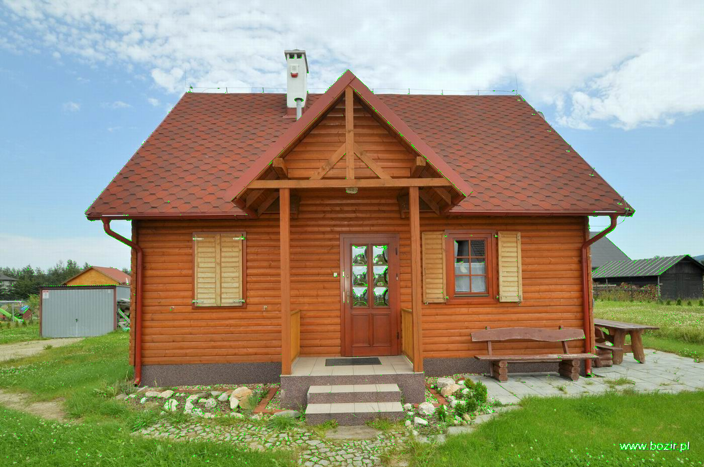

# Harrris-Corner-Detector
Calculating image's derivatives and detecting corners using Harris algorithm

## How It Works
The script operates by first breaking down the input image into its RGB components. It then calculates the grey color value of each pixel using a weighted sum of the RGB values. Using this information, it performs a series of convolutions to detect intensity gradients in both the horizontal and vertical directions.

The core of the feature detection is based on the calculation of the R value, which is derived from the determinant and trace of the matrix of gradients. Corners are highlighted based on a threshold applied to the R value.

## Usage

To use this script, you need to choose an image you want to perform a Harris corner detector algorithm on.

In order to adapt the algorithm to your photo and liking you may consider changing the treshold and k values shown below:

```python
T = -500000*0.1
k = 0.06
```

You can also make changes to the calculation of the determinant and the trace of the matrix itself as well as the equation itself:

```python
det = conv_rixx[i, j] * conv_riyy[i, j] - conv_rixy[i, j] ** 2
tr = (conv_rixx[i, j] * conv_riyy[i, j])
R[i, j] = det - k * (tr) ** 2
```
## Example
The script was run on a house image.

Before corner detection:


After corner detection:




